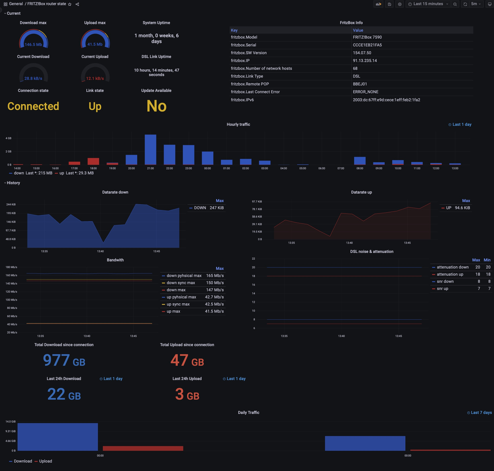

# Fritz InfluxDb

Fritz InfluxDb is a tiny daemon written in python to fetch data from a fritz box router and writes it to influxdb2.

# Requirements
* python3.11 or newer
* fritzconnection==1.11.0
* influxdb-client[ciso]==v1.36.0

# Setup

```
git clone https://github.com/pbdger/fritzinfluxdb
cd fritzinfluxdb
pip3 install -r requirements.txt
```

## Configuration

Copy the config from the [example](fritzinfluxdb.ini-sample) to ```fritzinfluxdb.ini``` and edit
the settings.

## Configure secrets

For security reasons you have to set the following secrets as environment variables.
```
FRITZBOX_PASSWORD=mysecretpassword
INFLUXDB_V2_TOKEN=mytoken
```

### Configure more attributes

check here to find a overview of more attributes which probaly could be added
https://wiki.fhem.de/w/index.php?title=FRITZBOX


## Run via CLI
```
./fritzinfluxdb.py
```

## Run with Docker
```
git clone <this_repo_url>
cd fritzinfluxdb
docker build -t fritzinfluxdb .
docker run -d -v /PATH/TO/fritzinfluxdb.ini:/app/fritzinfluxdb.ini --name fritzinfluxdb fritzinfluxdb
```

## Grafana Integration
You find a default Grafana board in the subfolder grafana.



## Docker image
You find an image here: https://hub.docker.com/repository/docker/pbdger/keba-rest-api


# License
>You can check out the full license [here](LICENSE.txt)

This project is licensed under the terms of the **MIT** license.
